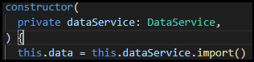

# セッション10
## データの読み込み
### 事前作業
- データファイルを`src/app/assets`の下などに配置しておく

### データ読み込み用のServiceクラス作成
- `src/app/shared`ディレクトリを作成
- `ng g service data`で`Sevice`クラスを作成
- `HttpClientModule`の`get()`メソッドでデータファイルを指定

### data-serviceの利用
- データを利用する`component`の`constructor`で`DataService`を定義

- `Subscribe`してデータを取り出す

----

## セッションのまとめ
- 次セッションでデータの操作と画面の表示を実施していきましょう

## Tips
- [HttpClientModule](https://mrkmyki.com/%E9%80%86%E5%BC%95%E3%81%8Dangular/angular%E3%81%A7http-get%E3%82%92%E4%BD%BF%E3%81%A3%E3%81%A6%E3%83%87%E3%83%BC%E3%82%BF%E3%82%92%E5%8F%97%E4%BF%A1%E3%81%99%E3%82%8B)
- [Observables](https://angular.jp/guide/observables)