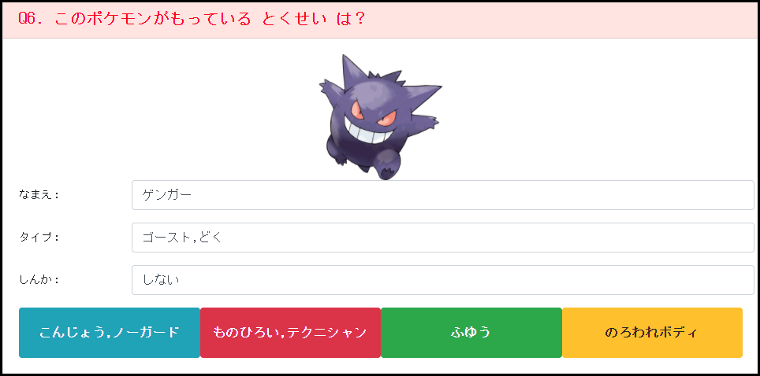

# セッション12
## データの表示
### 問題文を表示
- セッション11で作成した問題文を`question`などの変数に入れておく
- `html`側で`{{question}}`を指定して表示


### それ以外の項目を表示
- `FormGroup`の`PatchValue`を利用して、`Form`に各項目の値をセット
- `html`側では以下の様に指定

```
<input type="text" [class]="hoge" formControlName="types" readonly />
```


### 選択肢ボタンを表示
- セッション11で作成した選択肢をhtml側で以下のように指定

```
<button type="button" class="btn btn-info mb-1 col-lg-3 answer">
    {{ answer1 }}
</button>
```



----

## セッションのまとめ
次セッション以降で、選択肢を選んだ場合のClickイベント作成と、ダイアログの出し方を学んでいきます


## Tips
- データのユニークキー（一意に特定可能なキー項目）に紐づけて画像などを用意しておくとGood