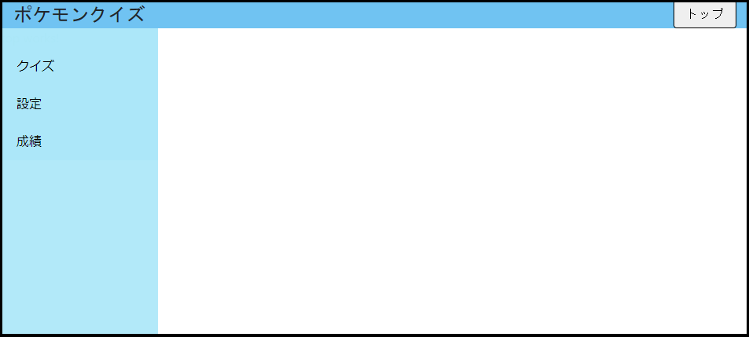

# セッション8
## ヘッダとサイドメニュー
### ヘッダの追加
-  `src/app/pages/` 配下に `shared` ディレクトリを作成し、その中にヘッダ用の `header-component` を作成
-  ※画面ではなく画面を構成するパーツなので、 `pages` 直下ではなく `shared`などの名称でディレクトリを作成し、その下に配置する方がベター
- ヘッダの表示には `@angular/material/toolbar` を導入すると見易いUIが利用可能
- style.scssにAngular Materialのcssを読み込み
 `'~@angular/material/prebuilt-themes/indigo-pink.css'; `

### サイドメニューの追加
-  `src/app/pages` 配下にサイドメニュー用の `side-menu-component` を作成
-  ※こちらも画面を構成するパーツなので、 `pages` 直下ではなく `shared`などの名称でディレクトリを作成し、その下に配置する方がベター

----

## セッションのまとめ
- scssに定義を追加して、積極的にレイアウトも調整していきましょう

## Tips
- [Angular Material Toolbar](https://material.angular.io/components/toolbar/overview)