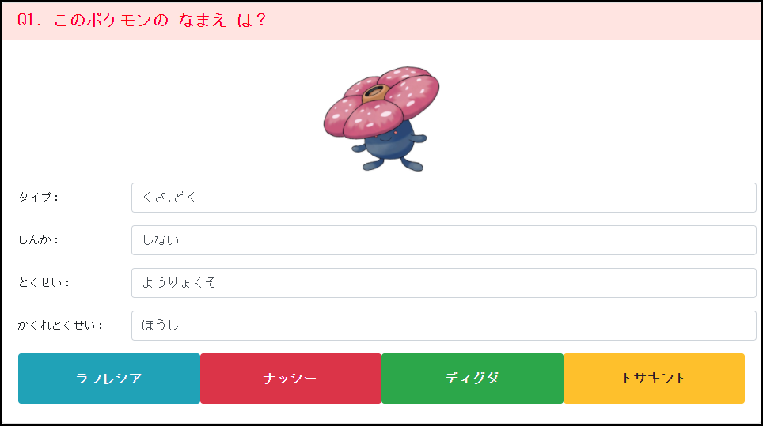

# セッション9
## クイズ画面作成
### 事前作業
- クイズ画面用の `component` を作成しておく

### 画面作成（html側）
- 問題の表示エリアを作成
- それ以外の補足情報の表示エリアを作成
- 問題に対して選択肢のボタンを作成

### リアクティブフォームの作成（component側と対応するhtmlの修正）
- `FormBuilder` を使ったフォームコントロールを作成

- `FormGroup`に対しては`patchValue`メソッドで値の設定が可能

----

## セッションのまとめ
- 次セッションで選定したデータの読み込みと画面への表示を実施しましょう

## Tips
- [ReactiveForms](https://angular.jp/guide/reactive-forms)